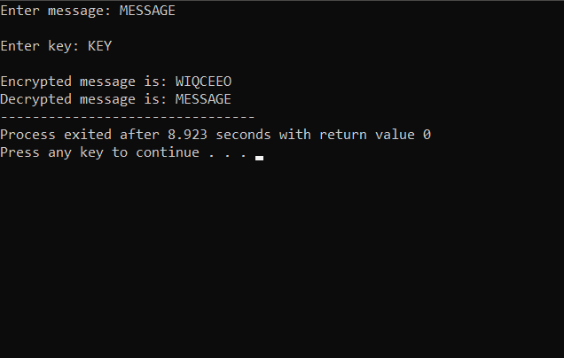
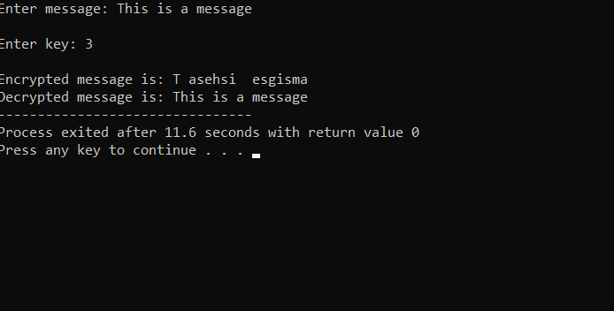

##### Q1. Implement Vigenere Cipher

###### Code :
  
```cpp
   
#include <iostream>
#include <string>

using namespace std;


string generateKey(string text,string key)
{
	string genKey;
	int i=0;
	while(genKey.length()!=text.length())
	{
		genKey+=key[i%key.length()];
		i++;
	}
	return genKey;
}

string encrypt(string text,string key)
{
	
	string genKey=generateKey(text,key);
	string enc;
	for(int i=0;i<text.length();i++)
	{
		enc+='A'+(genKey[i]+text[i]-2*'A')%26;
	}
	return enc;
}

string decrypt(string text,string key)
{
	
	string genKey=generateKey(text,key);
	string dec;
	for(int i=0;i<text.length();i++)
	{
		dec+='A'+(text[i]-genKey[i]+26)%26;
	}
	return dec;
}
int main() {
string message,key,enc,dec;
cout<<"Enter message: ";
cin>>message;
cout<<"\nEnter key: ";
cin>>key;
enc=encrypt(message,key);
cout<<"\nEncrypted message is: "<<enc;
dec=decrypt(enc, key);
cout<<"\nDecrypted message is: "<<dec;

  return 0;
}
```

<br>

###### Output:



<div style="page-break-after: always; visibility: hidden"> 
\pagebreak 
</div>

##### Q2. Implement Rail fence
```cpp
#include <iostream>
#include <string>
#include <vector>

using namespace std;

vector<vector<int>> mapping(int size,int key)
{
	int index=0,row=0;
	int dir=1;
	vector<vector<int>> hj(key);
	while(index!=size)
	{
		hj[row].push_back(index);
		if(row==key-1)
		dir=-1;
		else if(row==0)
		dir=1;
		row+=dir;
		index++;
	}
return hj;
}

string encrypt(string text,int key)
{
	vector<vector<int>> map=mapping(text.size(),key);
	string enc;
	
	for(int i=0;i<map.size();i++)
	{
		for(int j=0;j<map[i].size();j++)
	{
		enc+=text[map[i][j]];
	}
	}
	
	return enc;
}

string decrypt(string text,int key)
{
vector<vector<int>> map=mapping(text.size(),key);

	string dec(text.size(),'*');
	int ind=0;
	for(int i=0;i<map.size();i++)
	{
		for(int j=0;j<map[i].size();j++)
	{
		dec[map[i][j]]=text[ind++];
	}
	}
	return dec;
}

int main() {
string message,enc,dec;
int key;
cout<<"Enter message: ";
getline(cin,message);
cout<<"\nEnter key: ";
cin>>key;
enc=encrypt(message,key);
cout<<"\nEncrypted message is: "<<enc;
dec=decrypt(enc, key);
cout<<"\nDecrypted message is: "<<dec;
  return 0;
}

```
<br>

###### Output:



